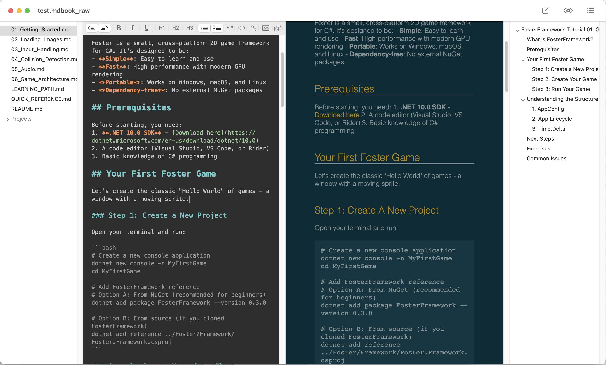

# MacDownEx

MacDownEx is an extension of the upstream MacDown project:

https://github.com/MacDownApp/macdown

## Screenshot

## What’s Different

This project focuses on workflow improvements on top of MacDown:

- Browser folder feature (open a folder and browse its files)
- Outline feature
- Editor toolbar items moved to the top of the editor view

## Build

From the repository root:

    git submodule update --init --recursive
    bundle install
    bundle exec pod install
    make -C Dependency/peg-markdown-highlight

Then open `MacDown.xcworkspace` in Xcode and build the `MacDown` scheme.
